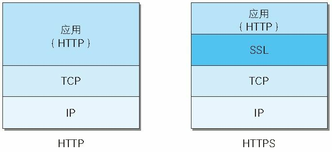

## HTTP

### 什么是 HTTP

HTTP（Hypertext Transfer Protocol），它是构建于 TCP/IP 协议的应用层协议，默认端口号 80，且是无连接[^1]无状态[^2]的。

### HTTP 报文构成

HTTP 协议以 ASCII 码传输，请求报文分为请求行、请求头部、空行、请求数据，响应报文分为状态行、消息报头、响应正文。

### 常见的请求方法

GET、POST、UPDATE、DELETE、PATCH 等。

> [Warning]
>
> GET 请求的 URL 有长度限制，但是 HTTP 协议并没有如此规定，而是浏览器对 GET 请求的限制。
> 协议规定 POST 的数据必须在 body 中，但是协议中没有规定使用哪种编码格式和数据格式。服务端通常是根据请求头中的 Content-type 字段获知请求的编码格式，在通过这种编码方式解码 body 中的数据。

## keep-alive 持久化

持久化的优势

- 持久化可以保持连接不自动断开，避免重复连接、断开带来的资源消耗；
- 持久化使得请求可以以管线化（pipelining）方式发送，这样就可以并行发送多个请求，而无需等待。

## HTTP 状态码

### 状态码分类

|     | 类别                            | 原因短语                   |
| --- | ------------------------------- | -------------------------- |
| 1xx | Informational(信息性状态码)     | 接收的请求正在处理         |
| 2xx | Success(成功状态码)             | 请求正常处理完毕           |
| 3xx | Redirection(重定向状态码)       | 需要进行附加操作以完成请求 |
| 4xx | Informational(客户端错误状态码) | 服务器无法处理请求         |
| 5xx | Server Error(服务器错误状态码)  | 服务器处理请求出错         |

### 常用状态码

#### **200 OK**

请求被正常处理。

#### **204 No Content**

请求已经成功处理，但是返回的响应报文中不含实体的主体部分。一般在只需要从客户端往服务器发送信息，而对客户端不需要发送新信息内容的情况下使用。

#### **206 Partial Content**

客户端进行了范围请求，服务端成功执行 GET 请求。响应报文中包含由 Content-Range 指定范围的实体内容。

#### **301 Moved Permanently**

永久性重定向。请求的资源被分配了新的 URI，以后应该使用新的 URI 访问。

#### **302 Found**

临时性重定向。请求的资源被分配了新的 URI，希望用户本次能使用新的 URI 访问。

#### **304 Not Modified**

该状态码表示客户端发送附带条件的请求[^3]时，服务器端允许请求访问资源，但未满足条件的情况。

#### **400 Bad Request**

请求报文中存在语法错误。

#### **401 Unauthorized**

该状态码表示发送的请求需要有通过 HTTP 认证的认证信息。另外若之前已进行过 1 次请求，则表示用户认证失败。 返回含有 401 的响应必须包含一个适用于被请求资源的 WWW- Authenticate 首部用以质询(challenge)用户信息。当浏览器初次接收到 401 响应，会弹出认证用的对话窗口。

#### **403 Forbidden**

请求被服务器拒绝。

#### **404 Not Found**

无法找到请求的资源。

#### **500 Internal Server Error**

服务器在执行请求时发生了错误。也有可能是 web 应用存在 bug 或某些临时的故障。

#### **503 Server Unavailable**

服务器暂时处于超负载或正在进行停机维护，现在无法处理请求。

## HTTP 首部

### HTTP 首部字段类型

#### 通用首部字段

请求报文和响应报文都会使用的首部。

#### 请求首部报文

客户端向服务端发送请求报文时使用的首部。

#### 响应首部字段

服务端向客户端返回响应报文时使用的首部。

#### 实体首部字段

针对请求报文和响应报文的实体部分使用的首部。

## HTTPS

HTTPS = HTTP + 加密 + 认证 + 完整性保护

### CA 加密过程

1. 申请者给 CA 提交服务器公钥，CA 用自己的秘钥对服务器公钥生成数字签名，并给把证书（证书 = 服务器公钥 + CA 的数字签名）颁发给申请者；
2. 服务器将证书下发给客户端，客户端使用 CA 的公钥（已经事先植入到浏览器）向 CA 验证证书的数字签名，以确认服务器公钥的正确性；
3. 客户端生成一个随机数 master secret，随后用服务器公钥加密 master secret 生成 pre-master secret 并传送给服务器；
4. 服务器使用服务器私钥解密接收到的 pre-master secret，得到 master secret，之后客户端与服务端即可正常通信。

[^1]: 无连接是指每次连接只能处理一个请求，不可以重复使用
[^2]: 无状态是指协议对于事物处理没有记忆能力，不会记录任何的状态
[^3]: 附带条件的请求是指采用 GET 方法的请求报文中包含 If-Match，If-Modified-SinceIf-None-Match，If-Range，If-Unmodified-Since 中任一首部
