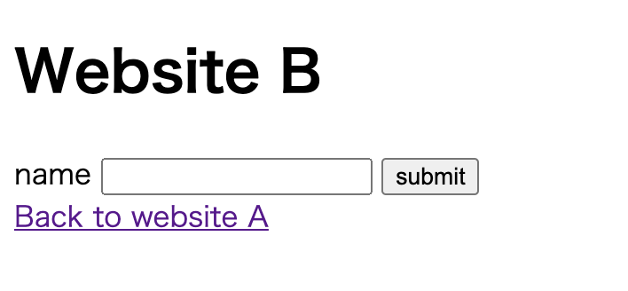

## 概念

Cross-Site Request Forgery（跨站伪请求）发生在第三方网站，主要的原理是借助浏览器获取用户凭证（cookie），然后向试图侵入的网站发起请求。

举个例子：

用户在浏览器上登录了 A 网站，A 网站的服务器验证通过后下发 cookie，随后浏览器将 cookie 保存下来，并在发现有发往 A 网站的请求时自动在请求上携带 cookie。此时用户在同一个浏览器上不经意打开了网站 B，B 网站会自动向 A 网站发起恶意请求，这即是“跨站伪请求攻击”。由于服务器无法分辨合法请求和伪造的请求，所以只要用户凭证是有效的，伪造请求也可以篡改服务器上的数据。

简而言之，CSRF 本质上就是第三方网站利用合法的用户凭证向目标服务器发起请求。

## CSRF Demo

如下是笔者设计的一个 demo，用于演示如何利用 CSRF 去篡改其它服务器上的数据。

在这个 demo 中，暂且把被攻击的网站称作 Website A，发起 CSRF 攻击的网站称作 Website B。

### Website A


> 线上地址：https://47.94.88.69
>
> 代码仓库：https://github.com/chaos-programming/csrf-app

Website A 是一个 Koa 服务端程序，我在它的路由上注册了两个路径: `/`和`/get`。

具体代码如下：

**GET /**

```
// 为了方便，直接用一个变量去存储数据 let name = 'chaos1ee'  // cookie的name和value const COOKIE_NAME = 'CSRF_COOKIE' const COOKIE_VALUE = 'Are you ok ?'  // 这里我们给cookie加上secure和SameSite属性 router.get('/', async ctx => {  // 访问网站的根路径  if (ctx.cookies.get(COOKIE_NAME) !== COOKIE_VALUE) {   ctx.cookies.set(COOKIE_NAME, COOKIE_VALUE, {    maxAge: 60 * 60 * 1000,    secure: true,    sameSite: false   })  }   await ctx.render('index', { name }) })
```

**GET /get**

```
router.get('/get', ctx => {  if(ctx.cookies.get(COOKIE_NAME) === COOKIE_VALUE) {   name = ctx.query.name   ctx.body = { name }  } else {   ctx.body = {msg: 'Unauthorized'}  } })
```

当用户访问"/"时，服务器会检查浏览器上是否存在 cookie “CSRF_COOKIE”，如若不存在则在浏览器上设置 cookie。我们把这个 cookie 当作用户凭证。

当用户访问”/get“时，服务器会检查浏览器上是否存在用户凭证（cookie）。若存在，则使用查询参数改变服务器上的数据。

前面的代码中我们给 cookie 设置了 secure 属性，这个属性要求 cookie 必须以 https 的方式传输，所以 A 是 https 加密的。同时我们还为 cookie 设置了`SameSite=None`属性，这样从第三方站点发往 A 的请求（GET、POST 等）都可以携带 cookie。

关于 Secure、SameSite 属性这部分的知识会在下文的“防范 CSRF 攻击【SameSite】”部分详细说明。

### Website B



> 线上地址：http://csrf-attacker.surge.sh
>
> 代码仓库：https://github.com/chaos-programming/csrf-app-attacker

Website B 的代码很简单，它只包含一个 html 文件，核心部分是一个表单。

**html**

```html
<form method="get" action="https://47.94.88.69/get" target="iframe">
  <label for="name">name</label>
  <input id="name" type="text" name="name" />
  <button type="submit">submit</button>
</form>

<!-- 阻止表单提交后自动跳转到 action url -->
<iframe id="frame" name="iframe" style="display:none;"></iframe>
```

每次提交表单的时候 B 就会发送一个 GET 请求到 A 服务器。

假如用户先访问了 A，浏览器将 A 的用户凭证保存在 cookie 中。而后用户访问 B，这时在 B 中发给 A 的请求也会携带上用户凭证。若 A 的用户凭证还未过期，那么 B 就成功地借用访问者的用户凭证发送了一个伪造请求。

需要注意的是在伪造请求的过程中，用户凭证并没有真正地泄露，攻击者只是利用了浏览器的机制借用了 cookie，但它并不能知晓 cookie 的内容。

## 防范 CSRF 攻击

既然已经知道了什么是 CSRF 攻击，接下来我们看下如何防范它。

其实现代浏览器已经对于 cookie 的使用做了很多限制，这一定程度上降低了网站遭受 CSRF 攻击的风险。

如果对于浏览的防御机制不太放心，我们可以通过以下几种方式去防范：

1. CSRF token；
2. 双重提交；
3. SameSite

### CSRF token

#### 同步 token 模式

这种模式必须在服务端生成 token，同时生成的 token 存放 Session 中。这种方式可以在每个请求中生成一个新的 token，也可以在每次用户会话期间重复使用一个 token。每次请求都生成 token 相比会话期间共用一个 token 的方式更安全，因为这种 token 的有效期更短，攻击者只能在很短的有效期内发起攻击。

CSRF token 之所以有效是因为如果没有 token 就不能发起有效的请求。这种模式的大致步骤如下：

1. 服务器生成 token，并将 token 存到 Session 中，随后下发 token 给前端；
2. 前端将获取到的 token 放置到隐藏的字段或头部中，然后在 form 提交和 ajax 请求时通过请求参数的方式传递给服务器。上传 token 的时候我们没有使用 cookie 的方式，因为这样就又会有遭遇 CSRF 攻击的风险了；
3. 服务器获取到请求中的 token 后，将其与 Session 中的 token 进行比较，若相同则验证通过。

这种方式需要注意避免泄露 token，get 请求相比 post 请求来说泄露的风险更高，因为 get 请求的 token 更可能直接在 url 中暴露。

CSRF token 的例子：

```html
<form action="/transfer.do" method="post">
  <input
    type="hidden"
    name="CSRFToken"
    value="OWY4NmQwODE4ODRjN2Q2NTlhMmZlYWEwYzU1YWQwMTVhM2JmNGYxYjJiMGI4MjJjZDE1ZDZMGYwMGEwOA=="
  />
  [...]
</form>
```

上面的例子改进一下，可以将 token 添加到自定义的 HTTP 头部，这样更加安全。

#### 加密 token 模式

还可以通过 Encrypted Token Pattern 的方式生成 token，这种方式最适合于不想在服务端维持状态的场景。这种模式下的 token 不是随机生成的字符串，而是通过算法计算得到的结果。在验证 token 的时候无需去存储中取，而是再做一次计算从 token 中解密出会话 id、时间戳和随机数。

具体的步骤是：

1. 服务器根据用户会话 Id 和时间戳生成 token，然后将 token 传递给客户端；
2. 客户端收到 token 后将它嵌入到表单的隐藏字段和 ajax 请求中；
3. 当服务端收到请求后从其中分离出 token，然后从 token 中解密出会话 id 与时间戳。若会话 id 用当前登录用户一致，且根据时间戳计算出的过期时间在当前服务器时间之后，则验证通过。

### 双重提交

维护 CSRF token 很麻烦，有一种相比于 CSRF token 来说更简单的方式，就是双重提交技术。双重提交相比 CSRF token 更易于实现，而且无状态。

实现方式是：

1. 当用户访问站点的时候，服务器随机生成一个强加密的随机值，并通过 cookie 的方式注入到浏览器；
2. 前端解析浏览器中的 cookie 并取出值，随后将随机值添加到请求参数中，cookie 和请求中携带的参数是相同的随机值；
3. 服务器收到后比较这两个值是否一致。如果一致，则验证通过。

但是这种方式的缺陷也很明显。由于子域可以修改父域下的 cookie，当子域沦陷后，攻击者有可能通过子域向父域注入自己的 cookie，这样服务器就无法分辨伪请求。

### SameSite

SameSite 是一个 cookie 属性，我们已经在之前的 demo 中提及过，它可以帮助浏览器确定是否在请求中携带 cookie。

接收三个值：

- Lax

  顶级导航和来自第三方站点的 GET 请求可以携带 cookie。

- Strict

  只会在第一方上下文携带 cookie。

- None

  所有上下文都可以携带 cookie。

关于 SameSite，IETF 提案[Incrementally Better Cookies](https://tools.ietf.org/html/draft-west-cookie-incrementalism-00) 提出两个关键点：

- 为未设置 SameSite 属性的 cookies 设置默认值`SameSite=Lax`。

  **未设置 SameSite**

  `Set-Cookie: promo_shown=1`

  **默认行为**

  `Set-Cookie: promo_shown=1; SameSite=Lax`

- 设置`SameSite=none`时必须设置 Secure 属性，确保运行在安全的上下文。

虽然出于安全考虑浏览器为 cookie SameSite 设置了默认值，但是理想情况下，应该显式设置 SameSite 属性。因为 [SameSite cookies explained](https://web.dev/samesite-cookies-explained/#samesitenone-must-be-secure) 一文中提到：

```
The default behaviour applied by Chrome is slightly more permissive than an explicit `SameSite=Lax` as it will allow certain cookies to be sent on top-level POST requests. You can see the exact details on [the blink-dev announcement](https://groups.google.com/a/chromium.org/d/msg/blink-dev/AknSSyQTGYs/YKBxPCScCwAJ). This is intended as a temporary mitigation, you should still be fixing your cross-site cookies to use `SameSite=None; Secure.
```

也就是说 chrome 的默认设置相较`于显式设置 SameSite=Lax 来说更为宽松，因为默认行为会允许部分 cookie 顶级导航时以 Post 的方式传递。

## 参考

1. [Cross-Site Request Forgery Prevention](https://cheatsheetseries.owasp.org/cheatsheets/Cross-Site_Request_Forgery_Prevention_Cheat_Sheet.html)
2. [SameSite cookies explained](https://web.dev/samesite-cookies-explained)
3. [SameSite cookies](https://developer.mozilla.org/zh-CN/docs/Web/HTTP/Headers/Set-Cookie/SameSite)
4. [Set-Cookie](https://developer.mozilla.org/en-US/docs/Web/HTTP/Headers/Set-Cookie)
