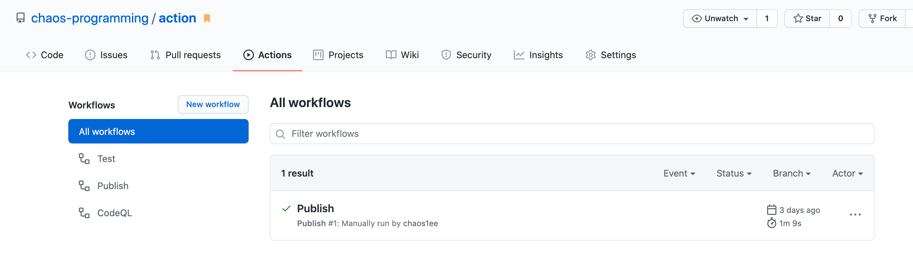

## Github Actions 介绍

Github Actions 是由 Github 推出的持续集成工具，它可以为开发者提供构建自动化 workflow 的新方式，且它是事件驱动的。

## Github Actions 中的一些重要概念

#### workflow

workflow 是用户添加到仓库中的自动化程序，它由一个或多个 job 组成，能够被各种事件触发。

#### event

event 指的是特定的可以触发 workflow 的活动。这篇文章 [Events that trigger workflows](https://docs.github.com/en/free-pro-team@latest/actions/reference/events-that-trigger-workflows) 介绍了各种事件。

#### job

job 是 step 的集合，它所包含的 step 在一个 runner 上执行。处在一个 workflow 中的不同 job 默认是并行执行的，但也可以设置成按序执行。

#### step

step 是可以执行 action 的独立任务。一个 job 中的所有 step 在一个 runner 上执行，这保证了所有 job 中的 action 可以共享数据。

#### action

action 是可以执行的命令，由它组成了 step。

#### runner

runner 指安装了 Github Actions runner 应用程序的服务器，它可以托管在 Github 上，也可以托管在自己的服务器上。runner 负责监听、运行 job，且同一时间只能运行一个 job，最后它可以给 Github 汇报执行进度、日志和结果。

## 创建自动发布 npm package 的流水线

接下来我们将借助一个 demo 阐述 Github Actions 的创建方式。

由于我们需要将包发布到 npm 上，所以可以先登陆 npm 创建一个 access token。npm access token 相关的知识可见 [About access tokens](https://docs.npmjs.com/about-access-tokens) 。

我们创建完token后，将其保存到github 项目下的 secret 中以供流水线使用，操作方式可见 [Creating encrypted secrets for a repository](https://docs.github.com/en/free-pro-team@latest/actions/reference/encrypted-secrets#creating-encrypted-secrets-for-a-repository)。

最后，我们在仓库的`.github/workflows/`目录下添加如下的 yaml 文件：

**publish.yaml**

```yaml
name: Publish

on:
  workflow_dispatch:
    inputs:
      version:
        description: Setup release version, e.g., major, minor, patch or specific version.
        required: true
        default: patch

jobs:
  publish-package:
    runs-on: ubuntu-latest
    steps:
      - name: Checkout
        uses: actions/checkout@v2
      - name: Setup Node.js
        uses: actions/setup-node@v1
        with:
          node-version: '12'
          registry-url: "https://registry.npmjs.org"
          scope: '@chaos1ee'
      - name: Get yarn cache directory path
        id: yarn-cache-dir-path
        run: echo "::set-output name=dir::$(yarn cache dir)"
      - name: Cache Node.js modules
        uses: actions/cache@v2
        id: yarn-cache
        with:
          path: $\{\{steps.yarn-cache-dir-path.outputs.dir\}\}
          key: $\{\{runner.os\}\}-yarn-$\{\{hashFiles('**/yarn.lock')\}\}
          restore-keys: $\{\{runner.os\}\}-yarn-
      - name: Install dependencies
        run: yarn
      - name: Setup version
        run: |
          git config --global user.email "chaos.maybeeee@gmail.com"
          git config --global user.name "chaos1ee"
          npm version $\{\{github.event.inputs.version\}\}
      - name: Push changes
        uses: ad-m/github-push-action@master
        with:
          branch: $\{\{github.ref\}\}
          tags: true
		  github_token: ${{secrets.GITHUB_TOKEN}}
      - name: Publish
        run: yarn publish --access public
        env:
          NODE_AUTH_TOKEN: $\{\{secrets.NPM_TOKEN\}\}
```

**上方 yaml 的含义：**

| **名称**            | 含义                                                                                                                                                                                                              |
| ------------------- | ----------------------------------------------------------------------------------------------------------------------------------------------------------------------------------------------------------------- |
| **name**            | 流水线名称。可选的。                                                                                                                                                                                              |
| **on**              | 可以触发流水线的事件名称。流水线的事件名称可以参照 [Events that trigger workflows](https://docs.github.com/en/free-pro-team@latest/actions/reference/events-that-trigger-workflows#configuring-workflow-events)。 |
| **jobs**            | 流水线中包含的所有 job 在此定义。                                                                                                                                                                                 |
| **publish-package** | job 名称。                                                                                                                                                                                                        |
| **runs-on**         | job 运行的虚拟环境。更多选项可见 [Job runs on](https://docs.github.com/en/free-pro-team@latest/actions/reference/workflow-syntax-for-github-actions#jobsjob_idruns-on)。                                                         |
| **steps**           | job 中执行的所有 step。                                                                                                                                                                                           |
| **use**             | use 指的是从社区中寻找提供的 action。从 [marketplace](https://github.com/marketplace?category=free&type=actions) 上可以找到一些第三方的 action。                                                                     |
| **run**             | 在 runner 上运行指定的命令                                                                                                                                                                                        |

还有更多语法可以从 [Workflow syntax for GitHub Actions](https://docs.github.com/en/free-pro-team@latest/actions/reference/workflow-syntax-for-github-actions#jobsjob_idstrategy) 上找到。

最后我们可以在Github仓库主页的【Actions】中执行流水线和查看流水线运行情况 。



## 参考

1. [Learn-github-actions](https://docs.github.com/en/free-pro-team@latest/actions/learn-github-actions)
2. [Github Actions contexts](https://docs.github.com/en/free-pro-team@latest/actions/reference/context-and-expression-syntax-for-github-actions#contexts)
3. [GitHub Actions: Manual triggers with workflow_dispatch](https://github.blog/changelog/2020-07-06-github-actions-manual-triggers-with-workflow_dispatch)
4. [Events that trigger workflows](https://docs.github.com/en/free-pro-team@latest/actions/reference/events-that-trigger-workflows#configuring-workflow-events)
