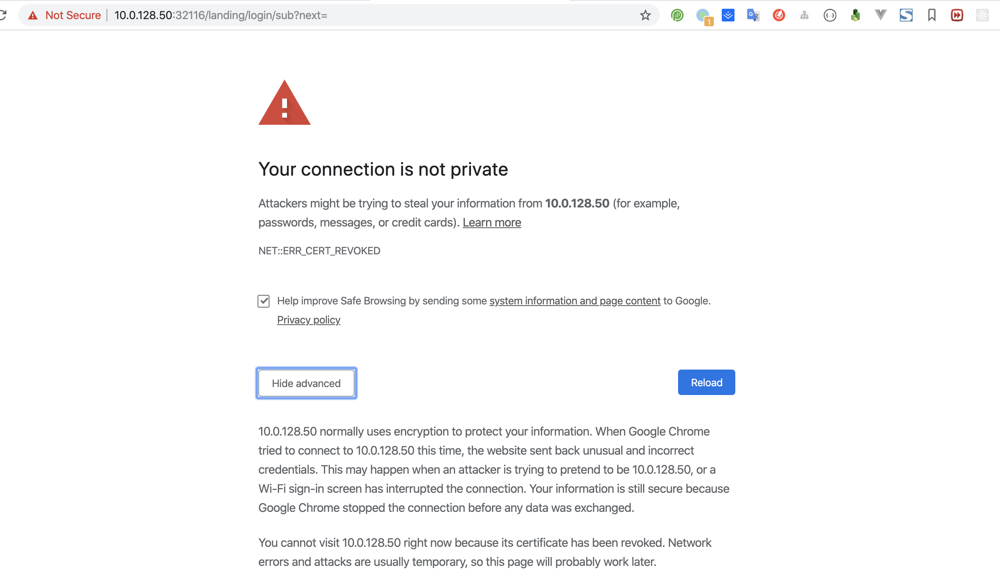
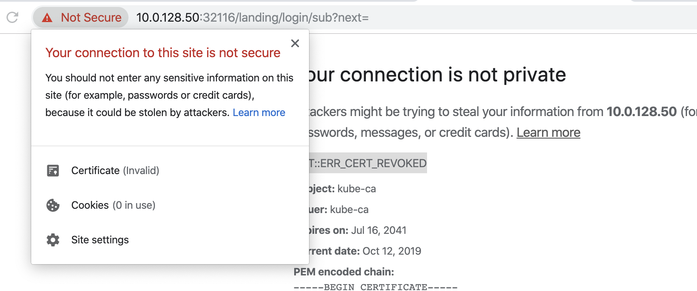
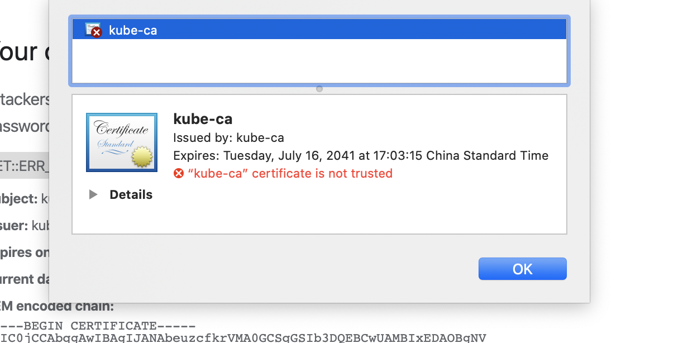
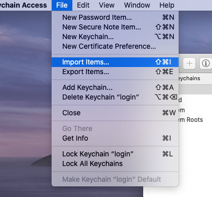
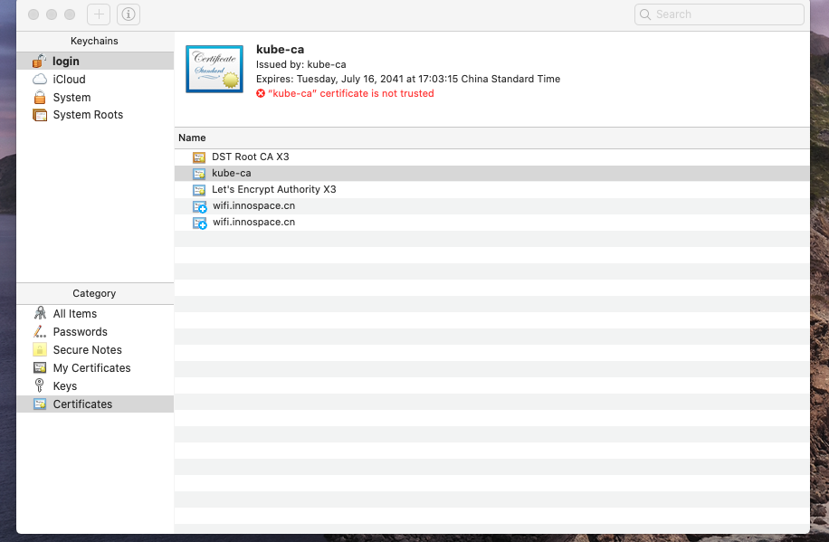
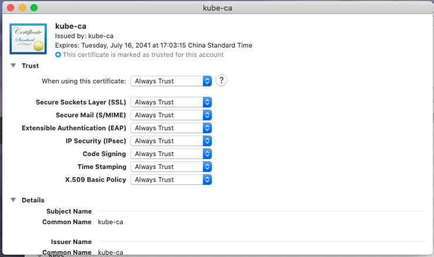

当我们在 chrome 上访问网页遇到证书问题的时候一般可以通过两种方式解决。

## 1.直接在页面输入“thisisunsafe”即可访问

参考：https://podtech.io/os/mac-osx/chrome-catalina-certificate-issue/

## 2.在本机上信任证书

在 chrome 上访问网站的时候遇到以下问题，通过“NET::ERR_CERT_REVOKED”（证书被撤销）可以看出是证书问题。

在地址栏左侧查看证书的位置可以得知证书不被信任

要想在不更换网站的证书的情况下正常访问该网页，可以更改该证书的信任级别（有风险需谨慎）。
从上图所示的位置拖拽证书到本地的目录下，即可将证书下载到本地。
在 mac 上打开“KeyChain Access”，将方才下载到本地证书导入，之后就可以看到证书已经被导入到本机。

打开这个不受信任的证书，更改它的信任级别为“Always Trust”，至此，该网页就可以正常访问啦。

