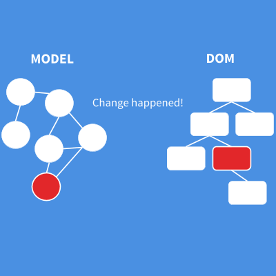
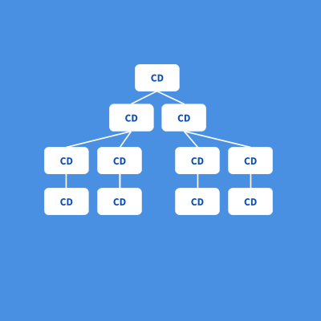
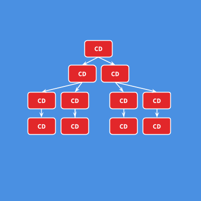
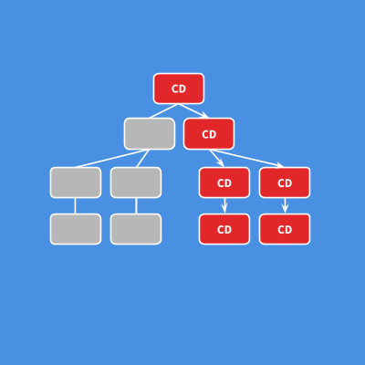
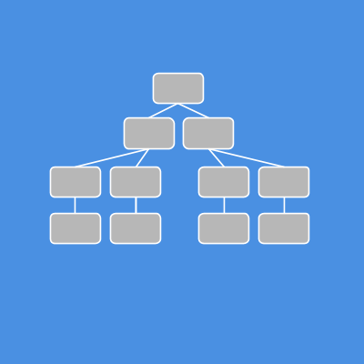
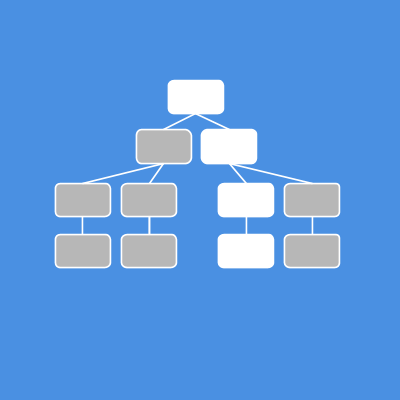

> 作者：[PascalPrecht](https://twitter.com/PascalPrecht)
>
> 原文地址：https://blog.thoughtram.io/angular/2016/02/22/angular-2-change-detection-explained.html
>
> 原文相关的资源可见：
>
> * slides： https://pascalprecht.github.io/slides/angular-2-change-detection-explained
> * youtube：https://www.youtube.com/watch?v=CUxD91DWkGM

## 什么是变更检测？

变更检测的基本任务是获取程序的内部状态，并使其以某种方式在用户界面上呈现。这个状态可以是任意类型的对象、数组、基本数据类型或任意JavaScript数据结构。

这个状态最终变成用户界面中的段落、表单、链接或按钮等，特别是在web中时，它被转化为文档对象模型（DOM）。所以基本上我们将数据结构作为输入，生成DOM输出并呈现给用户。这个过程称作渲染（rendering）。



然而，在runtime下变更产生时，事情仍然很棘手。某段时间后DOM已经被渲染。我们如何知晓model中发生了什么变化，以及应该在何处更新DOM？访问DOM树一直以来都是昂贵的，所以我们不仅要找出需要更新的地方，而且希望尽可能少地访问DOM。

这可以通过不同的方式来解决。例如，一种方式是简单地发起http请求然后重新渲染整个页面。另一种实现方式是比较DOM的新旧状态并仅更新有差异的部分，这正是ReactJS Virtual DOM中的概念。

[Tero](https://twitter.com/teropa)已经写了一篇很棒的文章[JavaScript框架中的变更检测](http://teropa.info/blog/2015/03/02/change-and-its-detection-in-javascript-frameworks.html)。如果你对不同的框架是如何解决变更检测这个问题感兴趣，我们建议你阅读它。本文我们将聚焦于Angular >= 2.x。

所以基本上变更检测的目的始终是投射数据及它的变更。

## 什么引起了变更？

现在我们已经知道了什么是变更检测，我们可能会疑惑：变更究竟何时产生？Angular什么时候知道必须更新视图？

好吧，让我们看看下面的代码：

```typescript
@Component({
  template: `
    <h1>{{firstname}} {{lastname}}</h1>
    <button (click)="changeName()">Change name</button>
  `
})
class MyApp {

  firstname:string = 'Pascal';
  lastname:string = 'Precht';

  changeName() {
    this.firstname = 'Brad';
    this.lastname = 'Green';
  }
}
```

如果这是你第一次见到Angular组件，你可能需要阅读这篇文章：[构建选项卡组件](https://blog.thoughtram.io/angular/2015/04/09/developing-a-tabs-component-in-angular-2.html)。

上面的组件仅展示两个属性，并提供一个点击模板中的按钮时改变这两个属性的方法。点击这个特殊的按钮的时刻正是应用状态发生改变的时刻，因为它改变了组件的属性。这正是我们要更新视图的时候。

下面是另一个例子：

```typescript
@Component()
class ContactsApp implements OnInit{

  contacts:Contact[] = [];

  constructor(private http: Http) {}

  ngOnInit() {
    this.http.get('/contacts')
      .map(res => res.json())
      .subscribe(contacts => this.contacts = contacts);
  }
}
```

这个组件包含一个联系人列表，而且在初始化时执行一个http请求。一旦这个请求返回，组件中的列表即被更新。同样，在这一点上，我们的应用状态已更改，因此我们要更新视图。

基本上，应用状态发生改变可能由以下三种情况导致：

1. 事件 - 点击、提交表单等等；
2. XHR - 从远端服务器获取数据；
3. 定时器 - `setTimeout`、`setInterval`等等。

上述的情况均是异步的。可以得出的结论是，基本上每当执行异步操作时，我们的应用状态可能被改变。这时需要告知Angular去更新视图。

## 谁通知Angular

好的，现在我们知道了是什么引起了应用状态变更。但是，是什么告知Angular在特定时刻必须更新视图呢？

Angular允许我们直接使用原生APIs。不必调用拦截器方法去通知Angular，就可以更新视图。这是魔法吗？

如果你关注了我们最新的文章，你将知道[Zones](https://blog.thoughtram.io/angular/2016/01/22/understanding-zones.html)会处理这些问题。事实上，Angular有它自己的zone，称作`NgZone`，我们已经在[Zones in Angular](https://blog.thoughtram.io/angular/2016/02/01/zones-in-angular-2.html)中介绍过。如有兴趣可以阅读。

简而言之，在Angular源码中的某处，有一个叫做`ApplicationRef`的东西，它监听`NgZone`的`onTurnDone`事件。每当此事件被触发，都会执行`tick()`函数，`tick()`函数实质上执行变更检测。

```typescript
// 真实代码精简版本
class ApplicationRef {

  changeDetectorRefs:ChangeDetectorRef[] = [];

  constructor(private zone: NgZone) {
    this.zone.onTurnDone
      .subscribe(() => this.zone.run(() => this.tick());
  }

  tick() {
    this.changeDetectorRefs
      .forEach((ref) => ref.detectChanges());
  }
}
```

## 变更检测

好的，很酷，我们现在知道变更检测何时被触发，但是它是如何执行的呢？嗯，首要我们要注意的是，**Angular中的每个组件都有自己的变更检测器（ change detector）** 。



这非常重要，因为这使得我们可以独立地控制每一个组件执行变更检测的方式和时间。这个问题可以在日后讨论。

我们可以假设组件树上的某处有一个事件被触发，比如某个按钮已被点击。接下来会发生什么？我们方才已经知道zones会执行给定的句柄，并且在`onTurnDone`回调中通知Angular，最终Angular执行变更检测。



因为每一个组件都有它自己的变更检测器，并且一个Angular应用维持一棵组件树，因此按照逻辑我们也拥有一棵变更检测器树（change detector tree）。该树也可以视作有向图，其中数据始终自上而下流动。

数据自上而下流动的原因是对于每个组件来说变更检测也总是自上而下执行，起始于根组件。这很棒，因为单向数据流比循环数据流更加可预测。我们始终知道在视图中使用的数据来自何处，因为它只能由其组件产生。

另一个有趣的观察是，变更检测在单向通道中更加稳定。这意味着，如果一个组件在变更检测期间的第一次运行后造成了任何额外的副作用，Angular将抛出一个错误。

## 性能

默认情况下，即使每次事件发生时我们都必须检测每个组件，Angular也非常快。它可以在几毫秒内执行数十万次检测。这主要是因为Angular生成的代码对VMs友好。

这意味着什么？当我们说每个组件都有自己的变更检测器时，并不是说Angular中存在一个通用的东西可以处理每个独立组件的变更检测。

这样做的原因是变更检测器必须是动态的，才能不必在意模型结构从而检测每个组件。VMs不喜欢这种动态代码，因为它不能进行优化。当对象的结构不总是相同时，它被称作多态的（polymorphic）。

在runtime下Anguar为每个组件创建了变更检测器，它们都是单态的（monomorphic），因为它们确切地知道组件的模型是怎么样的。VMs可以完美地优化这些代码，从而使得这些代码的运行速度非常快。好事是我们不必太关心这个过程，因为Angular自动为我们做了这些工作。

查阅[Victor Savkin’s](https://twitter.com/victorsavkin) 的演讲[Change Detection Reinvented](https://www.youtube.com/watch?v=jvKGQSFQf10) 可以更加深入地了解变更检测。

## 更聪明的变更检测

再次强调，每次事件发生时Angular都必须检测所有组件，因为应用的状态可能已经变化。但是如果我们可以告知Angular仅仅针对状态已经发生变更的部分运行变化检测，这样岂不是更好？

是的，这样很爽，而且事实上我们可以做到。某些数据结构（Immutables与Observable）可以帮助我们做到这点。如果我们恰好使用了这些数据结构或类型，并告诉了Angular，变更检测会快得多。好吧，那该怎么做呢？

### 理解变异性

为了理解诸如不可变数据结构（Immutable data structures）为何与如何起作用的，我们需要明白变异性（mutability）的含义。假设我们有如下组件：

```typescript
@Component({
  template: '<v-card [vData]="vData"></v-card>'
})
class VCardApp {

  constructor() {
    this.vData = {
      name: 'Christoph Burgdorf',
      email: 'christoph@thoughtram.io'
    }
  }

  changeData() {
    this.vData.name = 'Pascal Precht';
  }
}
```

 `<v-card>`是`VCardApp`的子组件，它有一个input属性`vData`。我们通过`VCardApp`的`vData`属性给子组件传递数据。`vData`是一个包含两个属性的对象。此外，存在一个可以改变`vData` 对象name属性的方法`changeData()`。 这里没有什么特别的魔法。

现在的关键是`changeData()`通过更改name属性来改变`vData`，即使这个属性将被更改，`vData`的引用本身保持不变。

假设某些事件导致`changeData()`被执行，那么在执行变更检测执行时会发生什么？首先，`vData.name`被更改，并且它被传递到`<v-card>`组件中，`<v-card>`组件的变更检测器检查`vData`与之前给定的是否相同。答案是肯定的，没有改变，因为引用没有变。然而，`name`属性已经变化，因此Angular仍将对该对象执行变更检测。

因为默认情况下，JavaScript中的对象是可变的（除了基本数据类型外），所以Angular必须保守地在每次事件发生时针对每个组件运行变更检测。

这正是不可变数据结构发挥作用之处。

## 不可变对象

不可变对象（Immutable objects）保证对象是不变的。意味着如果我们使用不可变对象，且将更改该对象，我们将总会获得该变更的新引用，因为该原始对象是不可变的。

下面的伪代码作为演示：

```typescript
var vData = someAPIForImmutables.create({
              name: 'Pascal Precht'
            });

var vData2 = vData.set('name', 'Christoph Burgdorf');

vData === vData2 // false
```

## 减少检测次数

当input属性没有改变时，Angular可以跳过整个子树的变更检测。我们刚刚了解到，“变更”意味着新的“引用“。如果我们在Angular应用中使用不可变对象，我们需要做的就是告诉Angular如果组件的输入没有改变，则组件可以跳过变更检测。

让我们看下`<v-card>`组件，看看下它是如何工作的：

```typescript
@Component({
  template: `
    <h2>{{vData.name}}</h2>
    <span>{{vData.email}}</span>
  `
})
class VCardCmp {
  @Input() vData;
}
```

如我们所见，`VCardCmp`仅依赖于它的input属性。通过将变更检测策略设置为`OnPush`，我们可以告诉Angular跳过此组件子树的变更检测（如果其inputs没有改变）：

```typescript
@Component({
  template: `
    <h2>{{vData.name}}</h2>
    <span>{{vData.email}}</span>
  `,
  changeDetection: ChangeDetectionStrategy.OnPush
})
class VCardCmp {
  @Input() vData;
}
```

这样就可以了！现在想象一下一棵更大的组件树。当使用不可变对象并通知Angular时，我们可以跳过整棵子树。



## Observables

如前面所说，当变更发生时Observable也能实现与不可变对象相同的效果。Observables不同于不可变对象，当变更产生时Observables不提供新的引用，取而代之的是触发事件，我们可以订阅事件并做出反应。

因此，当我们使用Observables的时候，假如我们希望通过`OnPush`策略跳过对子树的变更检测，可是Observables对象的引用永不改变，我们该如何处理这种情况呢？事实上，对于某些事件，Angular 有一个非常聪明的方法来使得组件树上的这条路被检测，而这个方法正是我们需要的。

为了理解这是什么意思，我们看看下面这个组件：

```javascript
@Component({
  template: '{{counter}}',
  changeDetection: ChangeDetectionStrategy.OnPush
})
class CartBadgeCmp {

  @Input() addItemStream:Observable<any>;
  counter = 0;

  ngOnInit() {
    this.addItemStream.subscribe(() => {
      this.counter++; // 程序状态变更
    })
  }
}
```

假如我们正在写一个有购物车的网上商城。用户将商品放入购物车时，我们希望有一个小计时器出现在我们的页面上，这样一来用户可以知道购物车中的商品数目。

`CartBadgeCmp`就是做这样一件事。它有一个`counter`作为输入属性，这个`counter`是一个事件流，它会在某个商品被加入购物车时被 fired。

我不会在这篇文章中对 `Observables` 的工作原理进行太多细节描述，你可以先看看这篇文章 [《Taking advantage of Observables in Angular》](https://blog.thoughtram.io/angular/2016/01/06/taking-advantage-of-observables-in-angular2.html)

除此之外，我们设置了变更检测策略为`OnPush`，因而变更检测不会总是执行，而是仅当组件的输入属性发生改变时执行。

然而，如前文提到的，`addItemStreem`永远也不会发生改变，所以变更检测永远不会在这个组件的子树中发生。这是不对的，因为组件在生命周期钩子 `ngOnInit` 中注册了这个事件流，并对 `counter` 递增了。这是一个程序状态的改变，并且我们希望它反应到我们的视图中，对吧？

下图是我们的变更检测树可能的样子（我们已经将所有组件设置为`OnPush`）。当事件发生的时候，没有变更检测会执行。



那么对于这个变更，我们要如何通知 Angular 呢？我们要如何告知 Angular, 即使整棵树都被设置成了`OnPush`，对于这个组件变更检测依然需要执行呢？

别担心，Angular 帮我们考虑了这一点。如前所述，变更检测总是自顶向下执行。那么我们需要的只是一个探测 (detect) 自**根组件**到**变更发生的那个组件**的整条路径而已。Angular无法知道是哪一条，但我们知道。

我们可以通过[依赖注入](https://blog.thoughtram.io/angular/2015/05/18/dependency-injection-in-angular-2.html)使用一个组件的`ChangeDetectorRef`，通过它你可以使用一个叫做`markForCheck()`的API。这个做的事情正好是我们需要的！ 它标记了从当前组件到根组件的整条路径，当下一次变更检测发生的时候，就会检测到他们。 我们把它注入到我们的组件：

```typescript
constructor(private cd: ChangeDetectorRef) {}
```

然后告诉Angular，标记整条路径，从这个组件到根组件都需要被checked：

```typescript
ngOnInit() {
    this.addItemStream.subscribe(() => {
      this.counter++; // application state changed
      this.cd.markForCheck(); // marks path
    })
  }
}
```

下图就是 Observable 事件发生之后组件树的状态：



现在，当执行变更检测的时候，只需简单地自上而下进行。


是不是很酷？变更检测运行结束后，它将恢复整个树的OnPush状态。

## 更多

实际上这篇文章中还有很多API没有涉及，但你可以看一下sildes和录像以了解更多。

希望这篇文章能够帮助你理解immutable数据结构以及 Observable是怎么让我们的 Angular 应用运行得更快的。
