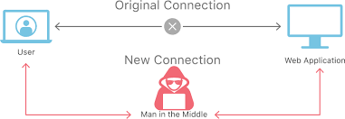
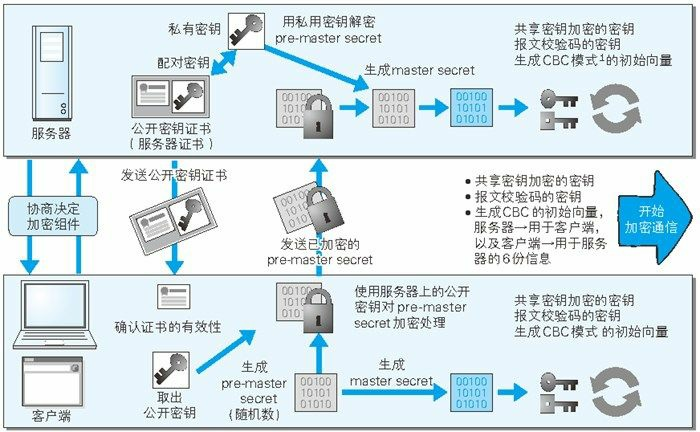

## 什么是 SSL ？

维基百科释义：

> SSL(Secure Scokets Layer，安全套接层)，及其继任者传输安全层(Transport Layer Security，TLS)是为网络通信提供安全及数据完整性的一种安全协议。TLS 与 SSL 在传输层对网络连接进行加密。

简而言之，ssl 是一项保证互联网连接安全的标准技术，它可以保护系统之间传输的敏感数据。

## SSL 的作用

信息明文传输带来的三大风险

1. 窃听风险：第三方可以获知通信内容。
2. 篡改风险：第三方可以修改通信内容。
3. 冒充风险：第三方可以冒充他人身份参与通信。

SSL/TLS 协议是为了解决这三大风险而设计的，它希望达到的目标：

1. 所有信息都是加密传播，第三方无法窃听。
2. 具有校验机制，一旦篡改，通信双方可以立刻察觉。
3. 配备证书，以防身份被冒充。

## 秘钥交换方案的演进

### 单纯使用对称加密算法

如果单纯使用对称加密，浏览器和服务器之间势必需要先交换对称加密的秘钥。

如果这个秘钥直接使用明文传输，那么秘钥将很容易被第三方偷窥到；如果这个秘钥使用密文传输，那么这个问题再次变成了“如何交换加密秘钥”的问题，实质上并没有解决秘钥交换的问题。

### 单纯使用非对称加密算法

非对称加密的加密和解密过程使用不同的秘钥，基于这个特点，可以避开前面提到的秘钥交换的问题。

它的大致步骤如下：

1. 服务器先基于非对称加密，随机生成一个秘钥对（简称 k1 和 k2），这个秘钥对保存在服务器上，目前并未被第三方知晓。
2. 服务器把 k1 保留在自己手中，将 k2 使用明文的方式发给客户端。因为 k2 是明文传输的，自然很容易被第三方窥探到，但是纵使第三方拿到了 k2，也很难根据 k2 推算出 k1（这一点是借助非对称加密算法从数学上保证的）。
3. 客户端拿到 k2 之后，先随机生成一个对称加密的秘钥 k，然后使用 k2 加密 k 得到 k'，客户端将 k'传输给服务器。由于只有 k1 和 k2 是成对的，所以只能使用 k1 解密 k2 加密的结果。因此在这一次传输的过程中，即使第三方能够拿到 k'也无法从 k'中解密出 k。
4. 服务器拿到 k'后，使用 k1 解密出 k。至此，服务器和客户端就完成了秘钥交换，双方就可以使用 k 来进行数据双向传输的加密了。

缺陷：

假设有一个攻击者处于客户端与服务器的通讯线路之间，并且这个攻击者可以修改双方传输数据，那么攻击这个就可以攻破“单纯使用非对称加密算法”这种方案：

1. 这一步跟原来一样，服务器生成 k1、k2。
2. 服务器给客户端发送 k2 的时候，攻击者截获 k2，然后攻击者自己生成一个伪造的秘钥对（pk1 和 pk2），随后将 pk2 发送给客户端。
3. 客户端接收到 pk2，由于客户端并不知晓攻击者的存在，所以客户端以为就是服务器发送过来的。这时候客户端依旧生成秘钥 k，然后使用 pk2 加密 k 生成 k'，并把 k'发送给服务器。这个时候 k'依旧被攻击者拦截，攻击者拿到 k'后使用 pk1 解密 k'得到 k，然后攻击者拿到 k 后，使用之前截获的 k2 加密 k 得到 k''，并把 k''发送给服务器。
4. 服务器收到 k''后使用自己保存的 k1 可以正常地解密得到 k，所以服务器并不会起疑心。

至此攻击者就完成窃取秘钥的过程，并且让客户端与服务器双方并没有感知到被攻击，这种模式称为“中间人攻击(Man-in-the-Middle Attack)”。

### 引入身份认证的加密算法

上一个方案之所以会失败，一方面是因为攻击者具备了篡改数据的能力，另一方面是因为缺乏身份认证机制。正是因为如此，导致客户端在接收到秘钥时并不能判别秘钥是否是来自真正的服务器，所以这时需要一种可靠的身份认证机制，可以保证就算攻击者篡改秘钥，也很容易被识破。

如何解决 SSL 的身份认证问题，这个时候自然而然就引入了 CA（Certificate Authority）。

数字证书加密解密过程如下：

1. 申请者给CA提交服务器公钥，CA用自己的秘钥对服务器公钥生成数字签名，并给把证书（证书 = 服务器公钥 + CA的数字签名）颁发给申请者；
2. 服务器将证书下发给客户端，客户端使用CA的公钥（已经事先植入到浏览器）向CA验证证书的数字签名，以确认服务器公钥的正确性；
3. 客户端生成一个随机数master secret，随后用服务器公钥加密master secret生成pre-master secret并传送给服务器；
4. 服务器使用服务器私钥解密接收到的pre-master secret，得到master secret，之后客户端与服务端即可正常通信。

## **参考文献**

1. Transport Layer Security <https://en.wikipedia.org/wiki/Transport_Layer_Security>
2. SSL/TLS 协议运行机制的概述 [http://www.ruanyifeng.com/blog/2014/02/ssl_tls.html](http://www.ruanyifeng.com/blog/2014/02/ssl_tls.html "http\://www.ruanyifeng.com/blog/2014/02/ssl_tls.html")
