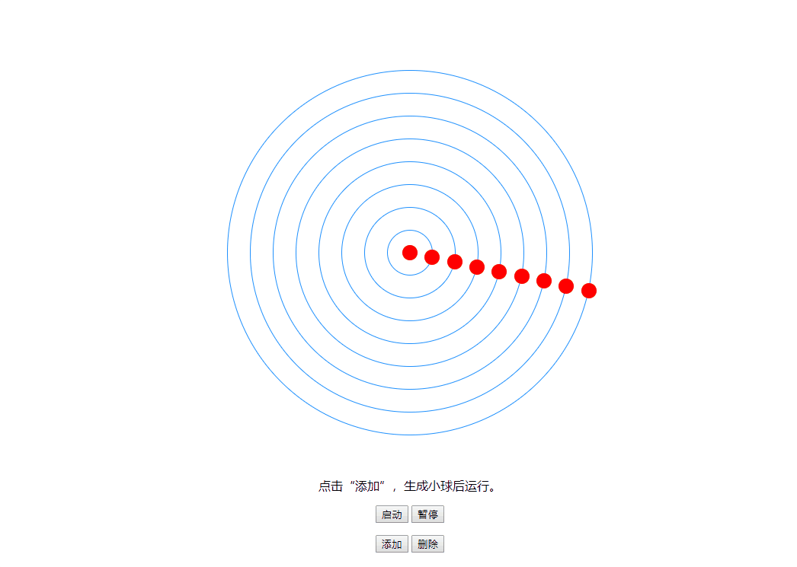

## CSS的方式
html
```html
<div class="wrapper">
    <div class="box">
        <div class="ball"></div>
    </div>
</div>
```

css
```css
html, body {
  margin: 0;
  padding: 0;
}

.wrapper {
  position: absolute;
  top: 50%;
  left: 50%;
  transform: translate(-50%, -50%);
}

@keyframes round {
  from {
    transform: rotate(0deg);
  }

  to {
    transform: rotate(360deg);
  }
}

.box {
  width: 200px;
  height: 200px;
  border: 1px solid blue;
  border-radius: 50%;
  animation: round 4s linear infinite;
}


.ball {
  position: absolute;
  width: 10px;
  height: 10px;
  border-radius: 50%;
  background: red;
  left: 50%;
  transform: translate(-50%, -50%);
}

```

## JS的方式



index.html

```html
<!DOCTYPE html>
<html lang="en">
  <head>
    <meta charset="UTF-8" />
    <meta name="viewport" content="width=device-width, initial-scale=1.0" />
    <meta http-equiv="X-UA-Compatible" content="ie=edge" />
    <title>Ball</title>
    <style>
      html,
      body {
        padding: 0;
        margin: 0;
      }

      .container {
        position: relative;
        width: 420px;
        height: 420px;
        border-radius: 210px;
        margin: 200px auto;
      }

      .panel {
        position: absolute;
        bottom: -200px;
        left: 0;
        right: 0;
        text-align: center;
      }

      .ball {
        position: absolute;
        width: 20px;
        height: 20px;
        border-radius: 10px;
        background: red;
      }

      .circle {
        box-sizing: border-box;
        position: absolute;
        border: 1px solid#1E90FF;
        border-radius: 250px;
        background: transparent;
      }
    </style>
  </head>

  <body>
    <div class="container">
      <div class="panel">
        <p>点击“添加”，生成小球后运行。</p>
        <p>
          <button class="run">启动</button> <button class="pause">暂停</button>
        </p>

        <p>
          <button class="add">添加</button> <button class="del">删除</button>
        </p>
      </div>
    </div>

    <script src="./ball.js"></script>
    <scirpt src="./ballGroup.js"></scirpt>
    <script>
      window.onload = function() {
        // buttons
        var runBtn = document.querySelector('.run');
        var pauseBtn = document.querySelector('.pause');
        var addBtn = document.querySelector('.add');
        var delBtn = document.querySelector('.del');

        // 容器
        var container = document.querySelector('.container');

        // 球形组实例
        var group = new BallGroup(container, 30, 200, 200);

        // 需要注意回调this指向：不使用bind，this指向window。
        runBtn.addEventListener('click', group.run.bind(group));
        pauseBtn.addEventListener('click', group.pause.bind(group));
        addBtn.addEventListener('click', group.add.bind(group));
        delBtn.addEventListener('click', group.remove.bind(group));
      };
    </script>
  </body>
</html>
```

ball.js

```javascript
/**
 * @description 小球类（在container中插入小球与圆形轨道）
 * @param r {number} 半径
 * @param x {number} 圆心X轴坐标
 * @param y {number} 圆心y轴坐标
 * @param n {number} 小球初始角度
 * @param container {DOMElement} 容器DOM元素
 */
var Ball = function(container, r, x, y, n) {
  this.container = container;
  this.r = r;
  this.x = x || 500;
  this.y = y || 500;
  this.n = n || 0;

  var fragment = document.createDocumentFragment();

  // 插入圆
  var style = window.getComputedStyle(this.container);
  this.circle = document.createElement('div');
  this.circle.classList.add('circle');
  this.circle.style.width = 2 * r + 'px';
  this.circle.style.height = 2 * r + 'px';
  this.circle.style.top = parseInt(style.height) / 2 - r + 'px';
  this.circle.style.left = parseInt(style.width) / 2 - r + 'px';
  fragment.appendChild(this.circle);

  // 插入小球
  this.el = document.createElement('div');
  this.el.classList.add('ball');
  this.el.style.top = y - r + 'px';
  this.el.style.left = x + 'px';
  fragment.appendChild(this.el);

  this.container.appendChild(fragment);
  // 角度矫正
  this.run.call(this, this.n);
};

// TODO: 优化动画性能
/**
 * @description 小球类run方法（旋转到角度n）
 * @param n {number} 小球目标角度
 */
Ball.prototype.run = function(n) {
  this.n = n;
  var a = Math.cos((this.n * Math.PI) / 180) * this.r;
  var b = Math.sin((this.n * Math.PI) / 180) * this.r;
  this.el.style.left = this.x + a + 'px';
  this.el.style.top = this.y + b + 'px';
};

/**
 * @description 移除小球与圆形轨道
 */
Ball.prototype.remove = function() {
  this.container.removeChild(this.el);
  this.container.removeChild(this.circle);
};
```

ballGroup.js

```javascript
/**
 * @description 小球组类
 * @param container {DOMElement} 容器DOM元素
 * @param interval {number} 小球运行轨道半径间隔
 * @param x {number} 圆心X轴坐标
 * @param y {number} 圆心y轴坐标
 */
var BallGroup = function(container, interval, x, y) {
  this.group = [];
  this.n = 0;
  this.uid = 0;
  this.running = false;
  this.x = x;
  this.y = y;
  this.interval = interval;
  this.container = container || document.querySelector('body');
};

// 修改了Ball类与BallGroup类的run方法。
// 将属于一个group的所有小球的run方法放到一个requestAnimationFrame的回调中执行。
// 而不是单独将每个小球的run方法加入一个requestAnimationFrame中。
// 试图改善性能，然而貌似并没什么卵用。
BallGroup.prototype.run = function() {
  if (this.group.length === 0 || this.timer) return;

  function _run() {
    this.n = ++this.n % 360;
    this.group.forEach(function(ball) {
      ball.run(this.n);
    }, this);
    this.timer = window.requestAnimationFrame(_run.bind(this));
  }

  _run.call(this);
};

BallGroup.prototype.pause = function() {
  if (this.timer) {
    window.cancelAnimationFrame(this.timer);
    this.timer = null;
  }
};

BallGroup.prototype.add = function() {
  if (this.uid > 8) return;
  var ball = new Ball(
    this.container,
    this.uid * this.interval,
    this.x,
    this.y,
    this.n
  );
  this.uid++;
  this.group.push(ball);
};

BallGroup.prototype.remove = function() {
  if (this.group.length > 0) {
    this.uid--;
    this.group.pop().remove();
    if (this.group.length === 0) {
      this.pause();
    }
  }
};
```
