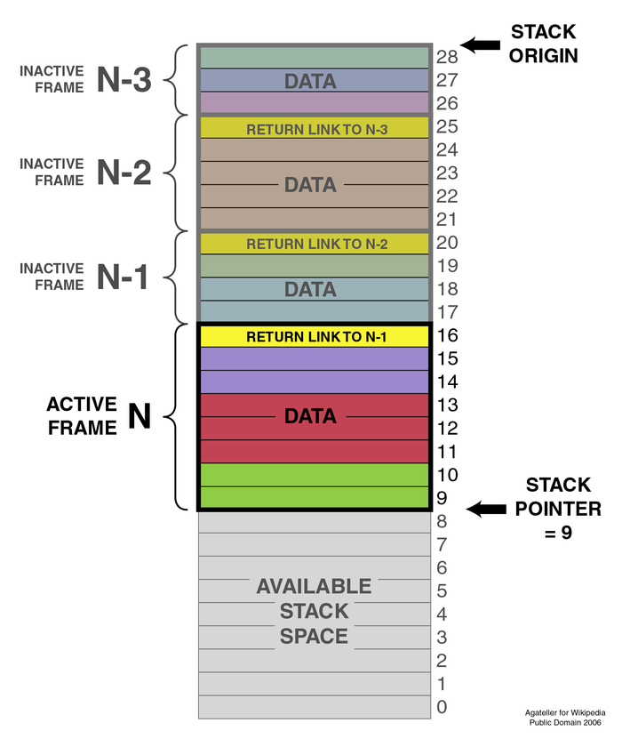

# 栈(stack)

栈是一种遵循<b>后进先出（LIFO）</b>原则的有序集合。新添加或待删除的元素都保存在栈的同一端，称作栈顶，另一端就叫做栈底。在栈里，新元素都靠近栈顶，旧元素都靠近栈底。



## 分步实现

### 创建栈

先声明一个类：

```javascript
function Stack() {
  // 各种属性和方法
}
```

选择数组来保存栈里的元素：

```javascript
let items = [];
```

为栈声明一些方法：

- push(element(s)): 添加一个或几个元素到栈顶。
- pop(): 移除栈顶的元素，同时返回被移除的元素。
- peek(): 返回栈顶的元素，不对栈作任何修改。
- isEmpty(): 如果栈里没有任何元素就返回 true，否则返回 false。
- clear(): 移除栈中的所有元素。
- size(): 返回栈里的元素个数。


### 给栈添加元素

```javascript
this.push = function(element) {
  items.push(element);
};
```

### 从栈中移除元素

```javascript
this.pop = function() {
  return items.pop();
};
```

### 查看栈顶元素

```javascript
this.peek = function() {
  return items[items.length - 1];
};
```

### 检查栈是否为空

```javascript
this.isEmpty = function() {
  return items.length === 0;
};
```

### 获取栈的长度

```javascript
this.size = function() {
  return items.length;
};
```

## 完整的实现代码（构造函数模式）

使用了作用域安全的构造函数模式，防止污染全局空间。

```javascript
function Stack() {
  if (this instanceof Stack) {
    this.items = [];

    this.push = function(element) {
      this.items.push(element);
    };

    this.pop = function() {
      return this.items.pop();
    };

    this.peek = function() {
      return this.items[this.items.length - 1];
    };

    this.isEmpty = function() {
      return this.items.length === 0;
    };

    this.size = function() {
      return this.items.length;
    };
  } else {
    return new Stack();
  }
}
```

## ES6 class 版本

```javascript
class Stack {
  constructor() {
    this.items = [];
  }

  push(element) {
    this.items.push(element);
  }

  pop() {
    return this.items.pop();
  }

  peek() {
    return this.items[this.items.length - 1];
  }

  isEmpty() {
    return this.items.length === 0;
  }

  size() {
    return this.items.length;
  }
}
```

## DEMO

### 进制转换

```javascript
function baseConverter(decNumber, base) {
  var remStack = new Stack();
  var rem;
  var baseString = '';
  var digits = '0123456789ABCDEF';

  while (decNumber > 0) {
    rem = Math.floor(decNumber % base);
    remStack.push(rem);
    decNumber = Math.floor(decNumber / base);
  }

  while (!remStack.isEmpty()) {
    baseString += digits[remStack.pop()];
  }

  return baseString;
}
```
