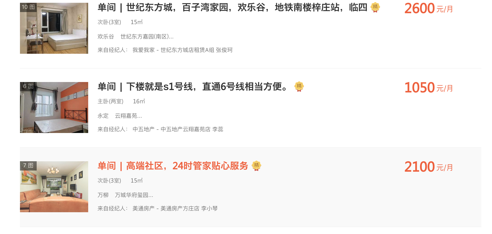

## 前言
一直以来都对爬虫挺感兴趣的，但是由于在很长的一段时间内缺乏对爬虫的基本认识，所以一直觉得爬虫是一项强大而又神秘甚至高不可攀的技术。再者，提到爬虫我的脑海中不自觉地涌现出“python”、“scrapy”等关键字（后来才知道也有很多使用 js 的爬虫框架），这也一定程度上打消了我继续钻研的兴趣。虽然 python 语法其实很简洁，但是熟悉新的语法与工具都是需要消耗很多时间的。直到后来，在浏览 github 的时候偶然间发现[puppetter](https://github.com/GoogleChrome/puppeteer)，粗略看了一下文档，遂决定尝试一番。

## puppeteer 简介


> Puppeteer 是一个 Node 库，它通过 DevTools 协议提供了
> 操作无头（headless）Chrome 或 Chromium 的高级 API。


## puppeteer 能做什么？

Puppeteer 可以完成在浏览器中手动完成的大部分事情。例如：

- 生成网页快照或者 PDF。
- 爬取 SPA 或者预渲染（如服务端渲染）的内容。
- 自动化表单提交、UI 测试、键盘输入等等。
- 创建最新的自动化测试环境。直接在最新版的 Chrome 中运行测试，并且支持最新的 JavaScript 和浏览器特性。
- 捕获网站的时间线，帮助诊断性能问题。

## 开始

### 安装

创建一个 puppeteer 项目，安装依赖。

```
npm install puppeteer
```

### 编写 demo

使用 puppeteer 编写爬虫脚本非常便捷。下述代码创建了一个浏览器实例，随后打开一个新的页面，并访问`https://test.com`，最后生成网页快照并关闭浏览器。

```javascript
const puppeteer = require('puppeteer')(async () => {
  const browser = await puppeteer.launch();
  const page = await browser.newPage();
  await page.goto('https://test.com');
  // do something

  await page.screenshot({ path: 'test.png' });
  await browser.close();
});
```

puppeteer 官方仓库提供了完整的[API 文档](https://github.com/GoogleChrome/puppeteer/blob/master/docs/api.md#)，可以随时查询。

### 编写项目脚本

使用浏览器访问 58 同城租房信息首页 [http://gz.58.com/chuzu](http://gz.58.com/chuzu)。可以先打开浏览器的调试工具，观察一下目标页面的文档结构，对网站数据有一个初步的认识。



我们要爬取的网站以列表的形式呈现了在租房产的简略信息，点击列表中的图片，可以导航到对应房产的详情页面。

想要要爬取首页列表中的每一处房产的详细数据，就必须要使用 puppeteer 从首页导航到对应的详情页面。

这里可以通过两种方式实现：

1. 使用 puppeteer 在目标元素上触发点击事件，将页面导航到详情页。爬取完详细数据后再退回到首页，接着再爬取下一处房产的数据。

2. 观察 DOM 结构，可以看到列表的每一个 li 中都包裹了一个 a 链接，通过这个 a 链接，同样可以导航到详情页面。

此处我采用第二种方式。首先爬取首页列表中所有 a 链接中的地址，并保存到一个数组中。随后遍历这个数组，分别取得详情页面的地址，并传递给`page.goto`方法。

```javascript
let result = await page.evaluate(() => {
  let $ = window.$;
  let ret = [];
  // 筛选符合条件的列表项
  let items = $('.listUl li[logr]');
  // 遍历DOMList，从DOM节点中提取href属性的值，推入数组中
  items.each(function() {
    let url = $(this)
      .find('a')
      .attr('href');
    ret.push(url);
  });
  return ret;
});

// 循环导航到每个房产的详情页
while (result.length > 0) {
  let currentUrl = result.shift();

  await page.goto(currentUrl, {
    waitUntil: 'networkidle2',
  });

  await sleep(3000);

  let item = await page.evaluate(() => {
    // 从详情页提取房产信息（略）
  });
}
```

上述代码省略了从详情页提取房产信息的部分。主要是从页面提取数据需要根据页面具体的文档结构以及期望提取的信息作灵活的调整，基本上不存在通用的方案。同时这部分除了代码量大外，逻辑极其简单，对于熟悉 DOM 操作的前端工程师来说不存在任何问题。

上述代码还存在两个比较关键的点：

1. puppeteer 提供的 page.evaluate API。

)

从图上可以看出，一个 browser 实例可以对应多个 page，每一个 page 对应一个 frame，在 frame 中存在独立的执行上下文（ExcutionContext）。通过 page.evaluate API，我们可以在页面的上下文中执行代码。在上述的代码中我们就在 page.evaluate 的回调中拿到了页面上下文中的<b>\$</b>变量（jQuery 暴露的变量）。

1. sleep 函数。

很多网站都有相应的反爬虫机制，我在爬取 58 同城数据的时候，就因为频繁地在页面间导航而被迫需要输入验证码，从而导致爬取部分数据后无法继续爬取。这种时候我们可以自己写一个 sleep 函数，让 puppeteer 在分批次爬取数据的时候短暂的休眠，以避免因为操作频率过高而导致的失败。

```javascript
function sleep(ms) {
  return new Promise((resolve, reject) => {
    setTimeout(() => {
      console.log(`sleeping,zzz... ${ms}ms`);
      resolve();
    }, ms);
  });
}
```

编写完脚本后，我们就可以运行脚本爬取数据了。我们可以对爬取到的数据按照自己的需求处理，然后写入数据库。如下为测试时在控制台打印出的数据。

```json
{
  "title": "(单间出租)松岗园 品牌好房 小区物业环境好 房租月付",
  "price": 1481,
  "covers_hash": [
    "765e981cff9003da50c34a63ef98fb52",
    "b1b974601589ba9ccba392d173c9d99d",
    "4757d31adcfe9081a3bed72158c1cfa6",
    "81b52434feab4a1aa010427ca37ad2ce",
    "c93db77c9e614efd22a6b55260a9ac17",
    "192ddb5b0c3aa31346f4631959a8f100"
  ],
  "detail": "合租 - 主卧 - 男女不限,1室0厅0卫20平精装修,东南低层/共25层,松岗园,天河员村,员村二横路",
  "lease": "合租 - 主卧 - 男女不限",
  "type": "1室0厅0卫20平精装修",
  "dierection": "东南低层/共25层",
  "community": "松岗园",
  "location": "天河员村",
  "address": "员村二横路"
}
```
